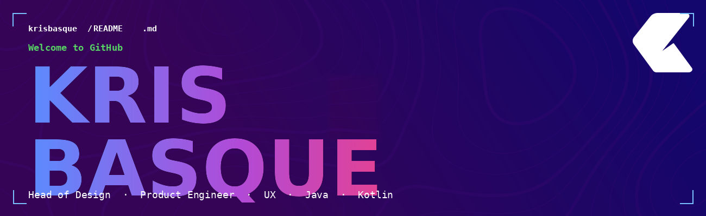

<div align="center">



# Kris Basque

**Head of Design / Product Engineer · UX · Java · Kotlin**

[](https://krisbasque.dev)
[](https://www.linkedin.com/in/krisbasque)
[](mailto:kris@krisbasque.dev)

</div>

---

### `~/KrisRepo [⎇ main]`

> **Hello, World!** Senior Product Designer with 25+ years of experience, now crossing the line into engineering. I've shipped products for clients like **Spotify**, **Vale**, **Nestlé** and **Harley-Davidson** — and I'm currently going deeper into the stack with Java and Kotlin.
>
> Most repos here are Java experiments and projects from my Systems Analysis degree at **FIAP**. Still breaking things, but on purpose now.
>
> 📍 Based in São Paulo 🇧🇷 · Open to Design Engineer roles · EU citizenship incoming 🇭🇺

---

### 🧩 Stack & Tools


---

### ⚡ Design × Engineering

```
/**
 *  25 years shaping how products feel.
 *  Now learning, line by line, how they work.
 *  @goal — Design Engineer who can ship the whole thing.
 */
```

---

### 📊 GitHub Stats


